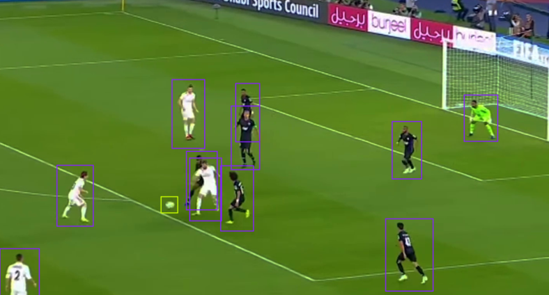
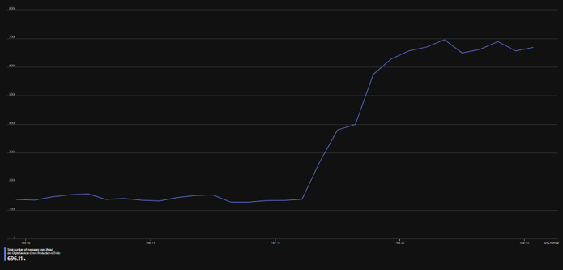

# Football Analysis
Football Analysis is a machine learning and computer vision powered tool to analyse and extract data from footage of a football match or training.

## Stats
The tool can track, count, and vizualise the number of goals, passes, shots on/off target, and player positions across time.

## MS Azure
The Football Analysis tool can be connected to an Azure IoT Hub in order to vizualise the generated data using Power BI for ease of access.
To connect your Azure IoT Hub, input your connection key in the `config.json` file.

